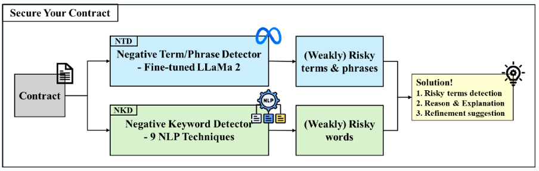

# Secure Your Contract: Towards Efficient and Reliable AI-Assisted Contract Drafting #

<div align="center">
    2024.09.11 ~ 2024.11.23
</div>


<div align="center">
    <a href = "https://drive.google.com/file/d/1vO6jFtQ8Ygiki4QbDn6Ri-9eeGkjAwDD/view?usp=sharing">Paper</a> | 
    <a href="https://drive.google.com/file/d/1wy5ONnGcgZ8GZr68zEpqBk3TQiGSb6lc/view?usp=sharing">PPT</a>
</div>


<br>

<p align="center">
    
</p>


**Secure Your Contract** is an AI-based contract assistant that helps you draft a contract avoiding possible disadvantageous terms & keywords.

It is based on **LLaMa 2 7B** for simplicity with much of references, finetuned using **QLoRA (4-bit quantization)** which is very promising towards a lightweight off-the-shelf system. Please go for <a href="https://huggingface.co/unsloth/llama-3-8b-bnb-4bit">LLaMa-3 8B 4-bit</a> as a backbone if you would like to build on this project.

**Secure Your Contract** provides two types of analysis:

1. **Negative Term Detector(NTD)**: LLM-based negative **term/phrases** detector will provide the detections against risky or weakly risky terms, the reasons for them and corresponding refinement suggestions.

2. **Negative Keyword Detector(NKD)**: Traditional NLP & text mining-based negative **keywords** detector consist of 9 different methodologies.


## 0. Data Preparation ##

<details>
<summary> Contract - Analysis Pairs </summary>

1. You need to download 100 ```contract``` keyword-related contract/agreement documents from [WONDER.LEGAL](https://www.wonder.legal/us) such that the model learns realistic examples. 

2. For both auto-generated (by ChatGPT in our method for **memory management**) and crawled data, contract(prompt)-analysis(response) data pairs are placed under ```./data/pair/prompt/``` and ```./data/pair/response/``` respectively with each separated as ```.txt``` files.
</details>

<details>
<summary> MITIE installation </summary>

1. You need to follow the instruction of [MITIE](https://github.com/mit-nlp/MITIE) github such that you are able to run ```./LLMs/mitie_finetune.py```. Place ```MITIE-models``` right under the root folder.
</details>

<details>
<summary> Convert Data Format </summary>

If you want to push your ```.json``` to your huggingface repository, run

```
cd utils
python3 save_oneliner.py
```

The code will convert the normal prompt - response paris to them for LLaMa-2 with your template applied.

If you want to convert PDF(s) to ```.txt(s)``` or ```.json```, run

```
cd utils
python3 pdf2json.py 
python3 pdf2text.py 
python3 pdfs2texts.py 
```

</details>

## 1. NTD (Negative Term Detector) ##
### Fine-Tuning ##

Fine-tune NTD(Negative Term Detector) with LLaMa-2 7B chat model with QLoRA:

```
cd LLMs
python3 finetune.py
```
Note you can change ```configs/finetune.yml``` for different settings.

### Inference ###

Inference with your fine-tuned model on the sample contract data:

```
cd LLMs
python3 inference.py
```

Note you can change ```configs/inference.yml``` for different settings.


## 2. NKD (Negative Keyword Detector) ##

```
cd LLMs
python3 neg_detect.py
```

Note using fine-tuned **MITIE** is not helpful, although it is possible.

## 3. Evaluate ##
To evaluate with **RAG(Retrieval Augmented Generation)**, run

```
python3 evaluate_rag.py
```

Note you need to contruct your FAISS DB first. Since LLaMa-2 has a limited token ingestion capacity, RAG rather degrades the model performance in our case.

<details> <summary> w/o Inference & w/o RAG </summary>
<br>

To evaluate your model with inference, run
```
python3 evaluate.py
```
To evaluate without inference, run
```
python3 evaluate_onlyscores.py
```

</details>

## 4. Visualize ##

For histograms, run

```
python3 visualize_histograms.py
```

For word clouds, run
```
python3 visualize_wordclouds.py
```